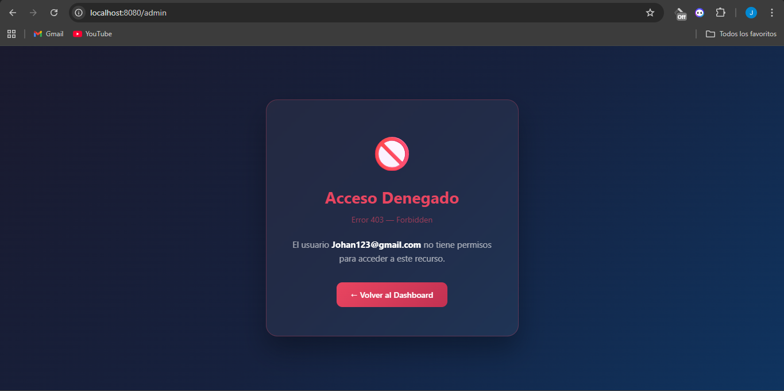
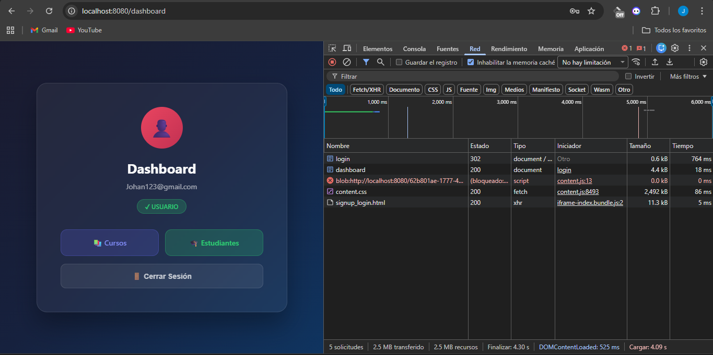

# Carreño-post2-u9 — Seguridad Avanzada en Aplicaciones Web

Extensión del Post-Contenido 1. Implementa @PreAuthorize, mitigación XSS, CSP header y verificación CSRF.

---

## Tecnologías utilizadas

- Java 17
- Spring Boot 3.2.5
- Spring Security 6 + @EnableMethodSecurity
- Spring Data JPA + Hibernate
- MySQL 8
- Thymeleaf + thymeleaf-extras-springsecurity6
- BCryptPasswordEncoder (strength 12)

---

## Configuración de MySQL

1. Tener MySQL corriendo en `localhost:3306`
2. Crear la base de datos:

```sql
CREATE DATABASE IF NOT EXISTS estudiantes_db;
```

3. Configurar credenciales en `src/main/resources/application.properties`:

```properties
spring.datasource.url=jdbc:mysql://localhost:3306/estudiantes_db
spring.datasource.username=root
spring.datasource.password=TU_CONTRASEÑA
```

4. Insertar el usuario ADMIN:

```sql
USE estudiantes_db;
INSERT INTO usuarios (nombre, email, contrasenia, rol, activo)
VALUES ('Administrador', 'admin@universidad.edu',
'$2a$12$uBiyXkLH9xiZtec91wnQveouTAqPMvvOoSunwzR6PZQuzQYA0ejM2', 'ROLE_ADMIN', 1);
```

---

## Ejecutar el proyecto

```bash
.\mvnw.cmd spring-boot:run
```

Abrir en: `http://localhost:8080/login`

---

## Usuarios de prueba

| Rol   | Email                     | Contraseña  |
|-------|---------------------------|-------------|
| USER  | johan123@gmail.com        | 12345678    |
| ADMIN | admin@universidad.edu     | admin123    |

---

## Rutas protegidas

| Ruta              | Acceso            |
|-------------------|-------------------|
| `/login`          | Público           |
| `/registro`       | Público           |
| `/dashboard`      | Autenticado       |
| `/cursos/**`      | Autenticado       |
| `/estudiantes/**` | Autenticado       |
| `/admin/**`       | Solo ADMIN        |

---

## Pruebas de Seguridad

### 1. @PreAuthorize — Error 403 personalizado

Se agregaron 4 métodos con `@PreAuthorize` en `UsuarioService`:

- `listarTodos()` → solo `ROLE_ADMIN`
- `buscarPorEmail()` → ADMIN o el propio usuario
- `cambiarRol()` → solo `ROLE_ADMIN`
- `actualizarNombre()` → el propio usuario o ADMIN

**Prueba:** Un usuario con rol USER intenta acceder a `/admin`. Spring Security intercepta la llamada a `listarTodos()` y redirige a la página de error 403 personalizada mostrando el nombre del usuario autenticado.



---

### 2. Content-Security-Policy (CSP)

Se configuró en `SecurityConfig` la cabecera CSP con las directivas:
default-src 'self'; script-src 'self'; style-src 'self' 'unsafe-inline'; img-src 'self' data:; frame-ancestors 'none'

**Verificación:** Chrome DevTools → Network → Response Headers → `Content-Security-Policy`.

